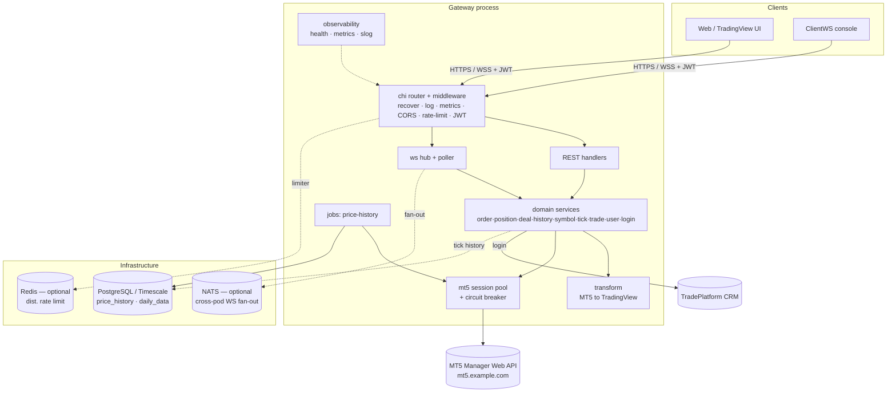
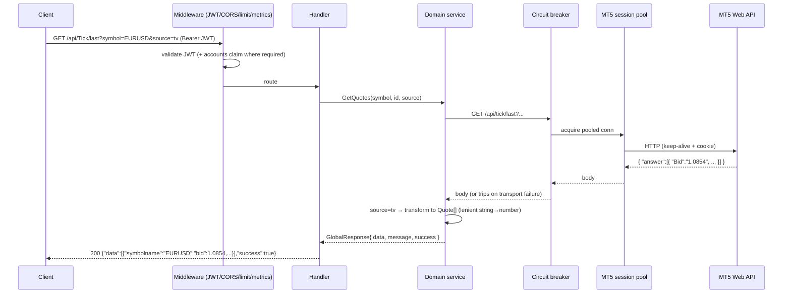
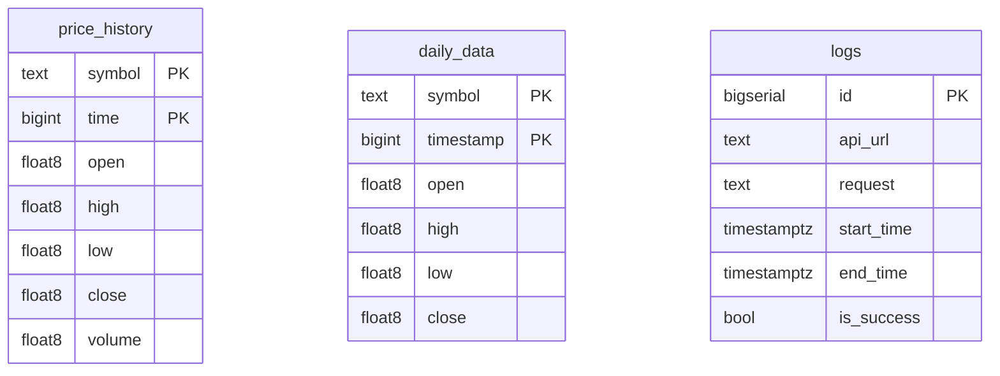

# LegacyMTSocket Go Gateway — Complete Documentation

A single, comprehensive reference for the project: what it is, how it's built,
how it works, the full API, optimizations, infrastructure, Docker, and how to run
and verify it. Detailed sub-documents are linked where deeper coverage exists.

> Diagrams use Mermaid (rendered by GitHub). The detailed docs:
> [TECH_PLAN](TECH_PLAN.md) · [ARCHITECTURE](ARCHITECTURE.md) · [API](API.md) ·
> [CONFIGURATION](CONFIGURATION.md) · [USAGE](USAGE.md) · [ANALYSIS](ANALYSIS.md) ·
> [PARITY-NOTES](PARITY-NOTES.md) · [TEST_RESULTS](TEST_RESULTS.md) ·
> [ENDPOINT_TEST_RESULTS](ENDPOINT_TEST_RESULTS.md) · [VOLUME-UNITS](VOLUME-UNITS.md).

## Table of contents
1. [Overview](#1-overview)
2. [Architecture](#2-architecture)
3. [How it works](#3-how-it-works)
4. [REST API](#4-rest-api)
5. [WebSocket](#5-websocket)
6. [Tech stack & libraries](#6-tech-stack--libraries)
7. [Database](#7-database)
8. [Optimizations](#8-optimizations)
9. [Infrastructure & deployment](#9-infrastructure--deployment)
10. [Docker](#10-docker)
11. [Configuration](#11-configuration)
12. [How to run](#12-how-to-run)
13. [How to check / verify](#13-how-to-check--verify)
14. [Security](#14-security)
15. [Testing](#15-testing)
16. [Operations & troubleshooting](#16-operations--troubleshooting)
17. [Roadmap / deferred](#17-roadmap--deferred)

---

## 1. Overview

TradePlatform gateway is a **stateful API gateway** between TradePlatform client apps (web,
TradingView UI, console) and the **MetaTrader 5 Manager Web API**
(`mt5.example.com`). It is a faithful Go reimplementation of the .NET 8
`LegacyMTSocket` service, exposing the MT5 API as **REST endpoints** and a
**`/ws` streaming endpoint**, and is designed to scale to ~1,000,000 users.

**Prime directive:** external behavior (routes, payloads incl. exact JSON
casing, status codes, the WS contract) is **identical** to the .NET service so
clients need no changes. Only the auth/CORS posture is hardened (with config
switches to restore legacy behavior during a migration).

**Status:** feature-complete, tested, and **deployed in production** on the VPS
(native Windows binary on port 5070, alongside the unchanged .NET gateway on
5063, with a local PostgreSQL).

---

## 2. Architecture

A single **role-gated Go binary** runs everything on one node and can be split
into per-role deployments (`api`, `ws`, `poller`, `mt5`, `jobs`) for horizontal
scale — no code change.



**Package layout** (`internal/`):

| Package | Responsibility |
|---|---|
| `config` | typed env config + production-fatal validation |
| `auth` | JWT (HS256) issue/validate; CRM login + account discovery |
| `mt5` | upstream paths, MD5/UTF-16LE handshake, pooled keep-alive client, circuit breaker |
| `domain` | one service per MT5 domain; envelope + per-endpoint data-shape logic; `MT5Client`/`PriceStore` interfaces |
| `transform` | MT5→TradingView models, mappings, converters, lenient JSON numbers |
| `httpapi/{response,middleware,handlers}` | envelope, middleware, handlers, chi routing, web UI (landing + Swagger) |
| `realtime` | `/ws` server, shared-topic hub, demand-driven poller, Bus (in-proc + NATS) |
| `store/timescale` | pgx store: hypertable, COPY ingest, aggregation, advisory lock |
| `jobs` | price-history fetch + aggregate, cron scheduler (lock-guarded) |
| `cache` | Redis client + distributed token-bucket limiter |
| `observability` | slog logging (rotating), health/readiness, Prometheus metrics |
| `cmd/gateway` | wiring + lifecycle |

See [ARCHITECTURE.md](ARCHITECTURE.md) for the full design rationale and
[TECH_PLAN.md](TECH_PLAN.md) for the concurrency model.

---

## 3. How it works

### 3.1 REST request flow



**The response envelope** is identical to .NET:
`{ "data": <any>, "errorMessage": null, "message": "...", "success": true }`,
with `success:true`→200 and `success:false`→400.

**Per-endpoint `data` shape** (preserved exactly):
- **string** — raw upstream JSON as a JSON-encoded string (passthrough endpoints)
- **object** — typed object (`source=mt5` on TV-capable endpoints)
- **TV shape** — TradingView model(s) when `source=tv`

`source` (default `mt5`) selects raw vs TradingView output. See
[PARITY-NOTES.md](PARITY-NOTES.md) for the exact classification.

> **Key real-world detail:** the live MT5 API returns numbers as JSON strings
> (`"Bid":"1.0854"`). The `transform` package uses lenient `Float/Int` types that
> decode from a number **or** a quoted string, so the `source=tv` transforms work
> against the real broker (Go's strict JSON otherwise can't).

### 3.2 MT5 session & authentication

The gateway holds a **pool of authenticated connections** (default 1 = parity
with the .NET single pinned socket). Each is an `http.Client` pinned to one
keep-alive TCP connection with a cookie jar, kept warm by a 20 s ping with
auto re-auth after consecutive failures.

```mermaid
sequenceDiagram
  participant G as Gateway (mt5.SessionManager)
  participant U as MT5 Web API
  G->>U: GET /api/auth/start?version&agent&login&type
  U-->>G: { srv_rand }
  G->>G: srv_rand_answer = MD5( MD5(MD5(utf16le(pw)) + "WebAPI") + fromHex(srv_rand) )
  G->>U: GET /api/auth/answer?srv_rand_answer&cli_rand
  U-->>G: 200 + Set-Cookie (session bound to this connection)
  loop every 20s
    G->>U: GET /api/test/access  (ping; re-auth on failure)
  end
```

The session is wrapped by a **circuit breaker**: transport failures trip it
(fail fast), while upstream business errors (4xx with a body) do not.

### 3.3 WebSocket flow & fan-out

The `/ws` subscription is the **query string** (no subscribe message). The server
pushes the serialized `data` every ~3 s.

```mermaid
flowchart LR
  subgraph singlenode[Single node default]
    c1[client] --> hub1[hub topic]
    c2[client] --> hub1
    hub1 -->|poll once per subscription, 3s| svc1[domain services] --> mt5a[MT5]
  end
  subgraph cluster[Cluster with NATS_URL set]
    c3[client@podA] --> hubA[hub@podA]
    c4[client@podB] --> hubB[hub@podB]
    hubA & hubB -->|demand| nats[(NATS)]
    poller[leader poller] -->|subscribe demand| nats
    poller -->|poll once per subscription| svc2[domain services] --> mt5b[MT5]
    poller -->|publish data| nats
    nats -->|fan-out| hubA & hubB
  end
```

Identical subscriptions share one upstream poll (O(symbols), not
O(connections)). With `NATS_URL` set, a single leader-elected poller does the
poll cluster-wide; hub pods subscribe and fan out. Backpressure: each connection
has a bounded send queue (latest-wins drop).

---

## 4. REST API

Base URL: `http://<host>:5070`. Auth: `Authorization: Bearer <jwt>`. `[A]` =
`[Authorize]` (JWT). `[AA]` = `[AccountsAuthorize]` (the `login` must be in the
token's `accounts` claim). Anonymous: Authentication and Capabilities. Full
parameters and shapes: [API.md](API.md).

| Group | Endpoints |
|---|---|
| **Authentication** (anon) | `POST /login`, `POST /crmlogin` → `{Token}` |
| **Order** `[A]` | `get` `get_total` `get_page`(AA) `get_batch` `delete` `update_order` `cancel` `list` `getbackup` `restore` `reopen` |
| **Position** `[A]` | `get` `get_total` `get_page`(AA) `get_batch` `update_position` `delete` `backup_list` `backup_get` `restore` `checkPosition` `fixPosition` |
| **Deal** `[A]` | `get` `get_total` `get_page` `get_batch` `update_deal` `delete` `backup_list` `backup_get` `restore_deal` `since` |
| **History** `[A]` | `get` `get_total` `get_page` `get_batch` `delete` `update_history` |
| **Symbol** `[A]` | `getlist` `getsymbolsbyname` `getsymbolsbymask` `getsymbolsbygroup` `getGroup` |
| **Tick** `[A]` | `last` `last_group` `stat` `history` `get` `getHistoryby1Dresolution` `get_marketdepth` |
| **Trade** `[A]` | `balance` `calc_buy_rate` `calc_sell_rate` `check_margin` `calc_profit` `send_request`(AA) `get_request_result` |
| **User** `[A][AA]` | `get` `get_trade_state` |
| **Test** `[A]` | `getServerTime` `getUTCTime` |
| **Removed compatibility** | `tv/TVOrder/*`, `Deal/GetDataByWebSocket`, `Test/testMethod*` all return 404 |
| **Operational** (anon) | `GET /healthz` `GET /readyz` `GET /` (status page) `GET /swagger` `GET /openapi.json`; metrics use the private listener only |

The complete production-shape suite passes 120/120 against local mocks (see [ENDPOINT_TEST_RESULTS.md](ENDPOINT_TEST_RESULTS.md)).
An interactive console is at **`/swagger`**.

---

## 5. WebSocket

`GET /ws?...` — JWT via browser subprotocol `tradeplatform.jwt.<jwt>` (alongside
`tradeplatform.v1`) or a Bearer header when `WS_REQUIRE_AUTH=true`. Legacy query-token
support is controlled by `WS_ALLOW_QUERY_TOKEN`. **Subscription = query string.** Params: `symbol, id,
methodtype, group, login, offset, total, ticket, TP, source, fromtime, totime,
data`.

| TP | Service | `methodtype` |
|---|---|---|
| 1 | Tick | `GetMarketDepth` `GetStatistics` `GetQuotes` `GetQuotesByGroup` `GetM1History` `GetHistoryBy1DResolution` |
| 2 | Position | `GetPosition` `GetTotalPosition` `GetPagebyPagePositionWs` `GetPositionBatch` |
| 3 | User | `Getbylogin` `GetTradeState` |
| 4 | Order | `GetPagebyPageOrder` |
| other | — | streams literal `Invalid TP value` |

The server pushes the serialized `data` field (not the envelope) every
`WS_PUSH_CADENCE` (default 3 s). Example:
```js
new WebSocket(
  'wss://host/ws?symbol=EURUSD&id=0&methodtype=GetQuotes&TP=1&source=tv',
  ['tradeplatform.v1', `tradeplatform.jwt.${token}`],
);
# < [{"symbolname":"EURUSD","status":"Ok","bid":1.0854,"ask":1.0856,"lastprice":1.0854,"volume":12}]
```
All 14 dispatch paths were verified live ([ENDPOINT_TEST_RESULTS.md](ENDPOINT_TEST_RESULTS.md)).

---

## 6. Tech stack & libraries

Go 1.26, stdlib-first, minimal dependencies.

| Concern | Library | Why |
|---|---|---|
| Router | `go-chi/chi` | tiny, `net/http`-native |
| WebSocket | `coder/websocket` | context-native, backpressure |
| MT5 HTTP | stdlib `net/http` | precise conn pinning + cookie jar |
| Config | `caarlos0/env` | struct-tag env binding |
| Logging | stdlib `log/slog` + `lumberjack` | structured + rotating files |
| JWT | `golang-jwt/jwt/v5` | HS256 parity |
| DB | `jackc/pgx/v5` | fastest PG driver + `CopyFrom` |
| Jobs | `robfig/cron/v3` | cron + PG advisory lock |
| Cache/limit | `redis/go-redis/v9` | distributed limiter |
| Messaging | `nats-io/nats.go` | cross-pod fan-out |
| Breaker | `sony/gobreaker` | MT5 egress |
| Metrics | `prometheus/client_golang` | `/metrics` |
| Tests | stdlib + `testify` + `miniredis` + golden files | |

---

## 7. Database

PostgreSQL 16 (TimescaleDB optional — the migration uses it best-effort and
falls back to plain Postgres). Two databases: **`market`** (OHLC) and
**`trading_ops`** (jobs/audit). Tables (created automatically on startup):



- **`price_history`** — intraday M1 candles (Timescale hypertable when available),
  unique `(symbol,time)`, index `idx_price_history_symbol_time`. **7-day
  retention** is enforced by the job (`DeleteOlderThan`) and, on Timescale, a
  retention policy.
- **`daily_data`** — daily OHLC aggregated from `price_history`.

**Background jobs** (role `jobs`, leader-elected via a PG advisory lock so
replicas don't double-fire):
- `fetch-price-history` (daily + once at boot): pulls each symbol's M1 candles
  from MT5 → bulk **`COPY` upsert** into `price_history`.
- `aggregate-daily` (chained): rolls intraday → `daily_data` (open=first,
  close=last, high=max, low=min).

Ingestion uses pgx **`CopyFrom`** into a staging table, then
`INSERT … ON CONFLICT … DO UPDATE` (binary COPY speed + upsert semantics).

---

## 8. Optimizations

- **MT5 connection pooling** — pinned keep-alive connections + cookie reuse; the
  whole pool sits behind a circuit breaker (fail fast, no 100 s hangs).
- **WebSocket fan-out** — one upstream poll **per subscription**, not per
  connection; with NATS, one poll **per subscription cluster-wide** (O(symbols)).
- **Backpressure** — bounded per-connection send queues (latest-wins drop) +
  a `ws_messages_dropped_total` metric.
- **Lenient JSON numbers** — decode MT5's string-encoded numbers without
  per-request reflection cost; correct AND fast.
- **Bulk DB ingest** — `CopyFrom` + `ON CONFLICT` upsert; `(symbol,time)` index;
  7-day retention to bound table size.
- **Caching seams** — in-proc symbol cache (matches .NET); Redis for a
  distributed rate limiter (and future shared cache).
- **Rate limiting** — per-IP token bucket (in-proc) or Redis-distributed across
  replicas; ops paths exempt.
- **Goroutine bounds** — upstream concurrency bounded by the pool; one goroutine
  per connection + one per active subscription (not per request).
- **Static binary** — CGO-free, ~23 MB, <50 ms start, no runtime deps.

---

## 9. Infrastructure & deployment

The gateway is **one static binary** (`deploy/docker/Dockerfile`, distroless).
The repository-level deployment — edge nginx + prebuilt terminal + gateway +
mock upstream on one Docker host — lives in `../../deploy/` and is driven by
`deploy/deploy.sh`; see the root README. `deploy/compose/docker-compose.yml`
is the local stack with PostgreSQL/TimescaleDB, Redis and NATS.

## 10. Docker

For a Linux host (not used on the Windows VPS):

- **`deploy/docker/Dockerfile`** — multi-stage build (Go 1.26 → distroless static),
  ~23 MB image, non-root.
- **`deploy/docker/Dockerfile.prebuilt`** — copies a prebuilt binary into
  distroless (offline / fast).
- **`deploy/compose/docker-compose.yml`** — full local stack: gateway +
  PostgreSQL/TimescaleDB + Redis + NATS.
- **`deploy/compose/docker-compose.prod.yml`** — gateway-only, API-only, port
  5070, builds from source.

```bash
make docker-build        # build the image
make compose-up          # full local stack
```

---

## 11. Configuration

All via environment variables with safe defaults — full table in
[CONFIGURATION.md](CONFIGURATION.md), template in [`.env.example`](../.env.example).
Highlights:

- **Required (prod):** `JWT_SECRET_KEY`, `MT5_LOGIN`, `MT5_PASSWORD`
  (`ENVIRONMENT=production` makes these fatal if missing).
- **Hardened toggles:** `WS_REQUIRE_AUTH`,
  `CORS_ALLOWED_ORIGINS`, `JWT_VALIDATE_ISSUER/AUDIENCE` (secure by default;
  legacy values for migration).
- **DB:** `TIMESCALE_DSN` (OHLC), `POSTGRES_DSN` (jobs); empty = API-only.
- **Realtime:** `WS_PUSH_CADENCE`, `WS_SEND_BUFFER`, `NATS_URL`.
- **Limits/logs:** `RATE_LIMIT_RPS/BURST`, `REDIS_ADDRS`, `LOG_FILE` + rotation.
- **Roles:** `ROLES=all` or any of `api,ws,poller,mt5,jobs`.

---

## 12. How to run

**Local (dev):**
```bash
cp .env.example .env       # set JWT_SECRET_KEY, MT5_PASSWORD (real data needs a whitelisted IP)
make run                   # :5063 by default
```

**Full local stack (Docker):**
```bash
make compose-up            # gateway + Postgres/Timescale + Redis + NATS
```


---

## 13. How to check / verify

```bash
# health
curl http://<host>:5070/healthz     # {"status":"alive"}
curl http://<host>:5070/readyz      # {"status":"ready"} once MT5 auth succeeds
# browser: http://<host>:5070/  (status page) and /swagger (API console)

# automated smoke (health + authed REST + WS upgrade)
BASE_URL=http://<host>:5070 ./scripts/smoke_test.sh

# metrics
curl http://<host>:5070/metrics | grep -E 'http_requests_total|mt5_requests_total|ws_active'

# DB (on the VPS)
psql -U postgres -d market -c "select count(*), count(distinct symbol) from price_history;"
psql -U postgres -d market -c "select count(*) from daily_data;"
```

Build/test locally:
```bash
go build ./... && go vet ./... && go test -race ./...
```
Results: [TEST_RESULTS.md](TEST_RESULTS.md), [ENDPOINT_TEST_RESULTS.md](ENDPOINT_TEST_RESULTS.md).

---

## 14. Security

- **Auth:** JWT HS256; `[AccountsAuthorize]` scopes account-specific endpoints.
- **Hardened defaults:** JWT required on `/ws`, CRM-only login, issuer/audience
  validated, CORS fail-closed, circuit breaker, rate limiting — each gated by
  config so the legacy .NET posture can be matched during coexistence.
- **Secrets:** via env (never logged); the production VPS keeps them in an
  ACL-protected `gateway.env` readable only by `SYSTEM` and Administrators;
  PostgreSQL listens on **localhost only** (not exposed).
- **Coexistence note:** while running beside .NET, auth/CORS are intentionally
  loosened (shared token compatibility). Harden after cutover — see

---

## 15. Testing

- **Unit/integration** (`go test -race ./...`, 12 packages): auth, middleware
  (JWT/accounts/CORS/rate-limit), MT5 handshake + breaker, transforms (98.7%),
  WS hub + poller + bus, jobs, Redis limiter (miniredis), response envelope.
- **Golden parity** — `internal/httpapi/handlers/testdata/golden/*.json` freeze
  the exact wire output for the three data-shape classes.
- **Live** — full mock MT5 + CRM (74 REST + 14 WS), then verified against the
  real broker on the VPS.
- **Smoke** — `scripts/smoke_test.sh` (health, authed REST, WS 101).

---

## 16. Operations & troubleshooting

Common cases:

| Symptom | Cause | Fix |
|---|---|---|
| `/readyz` 503, MT5 auth looping | broker rejects source IP (403) | whitelist the egress IP (the VPS is whitelisted) |
| `mt5_requests_total{result="open"}` | breaker tripped | recovers in 30 s; check broker reachability |
| Base URL / `/swagger` blank | testing wrong URL or container down | use `/healthz`; `/` is a status page, API is `/api/*` |
| External `:5070` unreachable, localhost OK | cloud firewall | open TCP 5070 in the provider console |
| Startup refuses (prod) | missing secrets | set `JWT_SECRET_KEY`/`MT5_PASSWORD` |
| No price-history rows | jobs role off or DB down | DB up + `ROLES` includes `jobs`; restart |
| Log file growth | — | rotated automatically (`LOG_FILE` + lumberjack) |

Compose quick ops (on the host, in `deploy/`):
```bash
docker compose ps
docker compose logs --tail 100 gateway
docker compose restart gateway
```

---

## 17. Roadmap / deferred

Seams are in place for: **TimescaleDB** extension (currently plain Postgres —
optional scale optimization); **Redis symbol cache**; a central **`mt5-session`**
role over gRPC; **multi-region**. The NATS cross-pod fan-out and the Redis
distributed rate limiter are implemented. See [ARCHITECTURE.md §11](ARCHITECTURE.md)
and [PARITY-NOTES.md](PARITY-NOTES.md).
