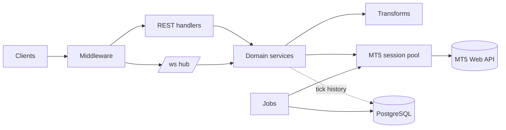

# Architecture

One **role-gated Go binary** (roles: api, ws, poller, mt5, jobs) that runs on a
single node or splits per-role for scale.

Layers: [[Middleware]] → [[REST API]] / [[WebSocket]] → [[Domain Services]] →
[[Transforms]] + [[MT5 Session]] (via [[Circuit Breaker]]). Cross-cutting:
[[Observability]], [[Configuration]]. Data: [[Database]], [[Price-History Jobs]].

See [[Request Flow]] · [[Concurrency Model]] · the full [[Architecture Board.canvas|board]].
