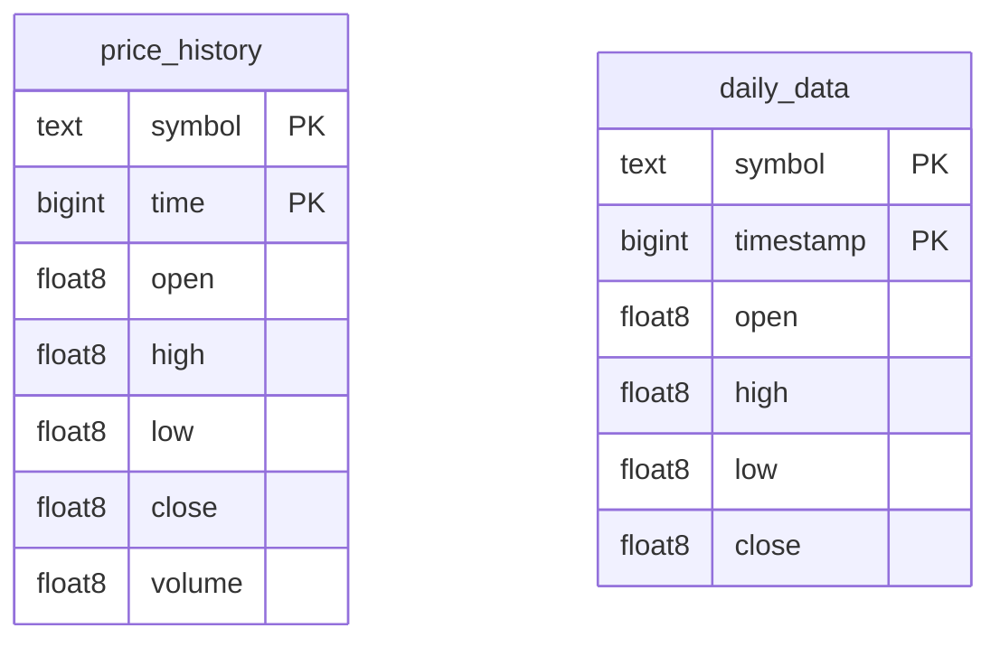

# Database

PostgreSQL 16 (`internal/store/timescale`, pgx). Two DBs: **market** (OHLC),
**trading_ops** (jobs/audit). TimescaleDB optional (best-effort; falls back to
plain Postgres). Tables auto-created on startup (migrations).

- `price_history` — intraday M1, unique `(symbol,time)`, 7-day retention.
- `daily_data` — aggregated daily OHLC.
- Ingest via pgx **CopyFrom** + ON CONFLICT upsert.

Filled by [[Price-History Jobs]]; read by Tick history. Related: [[Optimizations]].
