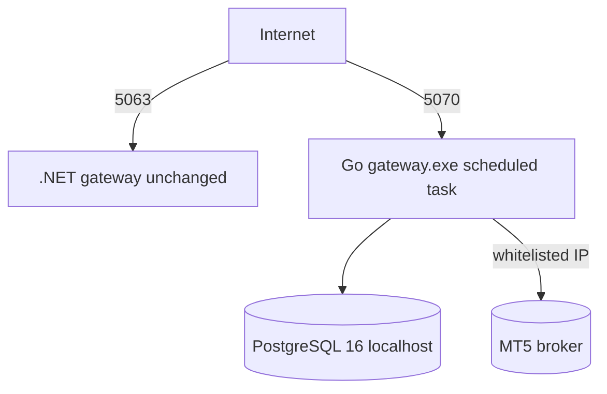

# Deployment — VPS (Windows native)

Production on `46.62.247.67` (Windows Server 2022), **alongside the .NET service**.

- Go on **5070**, .NET keeps **5063** (untouched). Shared JWT secret → tokens
  work on both.
- Native `gateway.exe` in `C:\opomtsocket-go\`; scheduled task `OpoGatewayGo`
  (onstart, SYSTEM, 60 s delay so [[Database]] is up first).
- [[Price-History Jobs]] ingesting; rotating logs.
- Scripts: `deploy/windows/` (`install-postgresql.ps1`, `setup-service.ps1`,
  `run.ps1`, `gateway.env.example`, `protect-config.ps1`).

Related: [[Configuration]] · [[Security]] · [[Infrastructure]]
