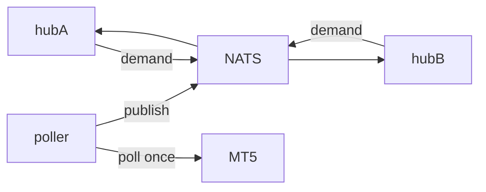

# Hub & Fan-out

The [[WebSocket]] engine.

- **Shared-topic hub:** identical subscriptions share one upstream poll
  (O(symbols), not O(connections)); last-message replay; ref-counted teardown.
- **Backpressure:** bounded per-connection queue, latest-wins drop (metric
  `ws_messages_dropped_total`).
- **Cross-pod (NATS):** a leader-elected **poller** does the single cluster-wide
  poll per subscription and publishes to the bus; hub pods subscribe → fan out.

Related: [[Optimizations]] · [[Kubernetes]]
