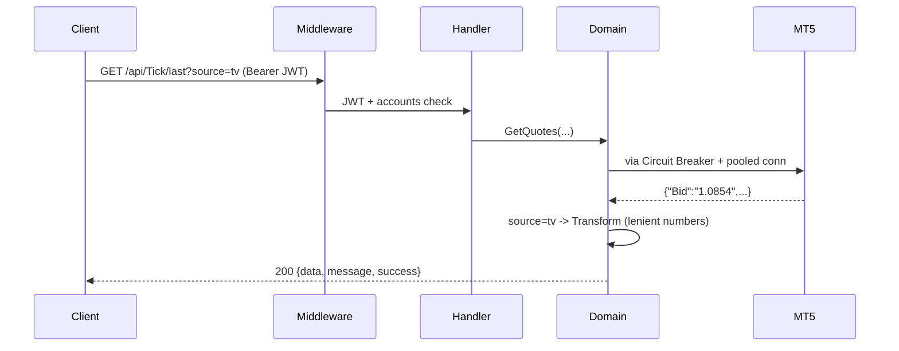

# Request Flow (REST)

Envelope: `{data, errorMessage, message, success}` — `success:true`→200,
`false`→400. `data` shape per endpoint: **string** (passthrough) / **object**
(`source=mt5`) / **TV shape** (`source=tv`). See [[Transforms]], [[Parity with .NET]].

Related: [[Middleware]] · [[Domain Services]] · [[MT5 Session]]
